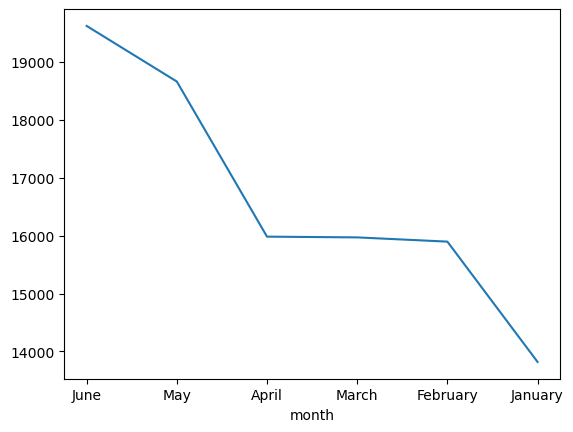
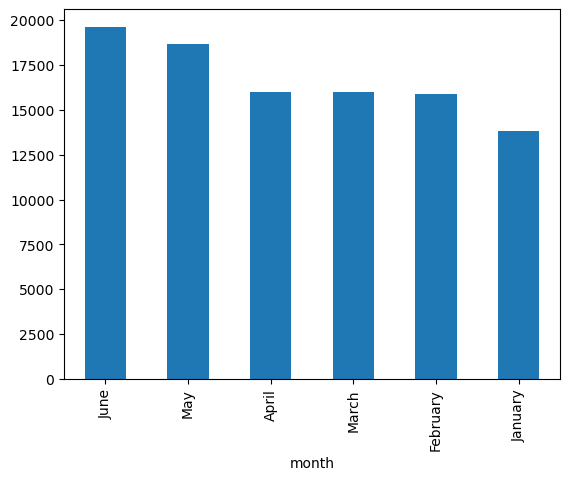
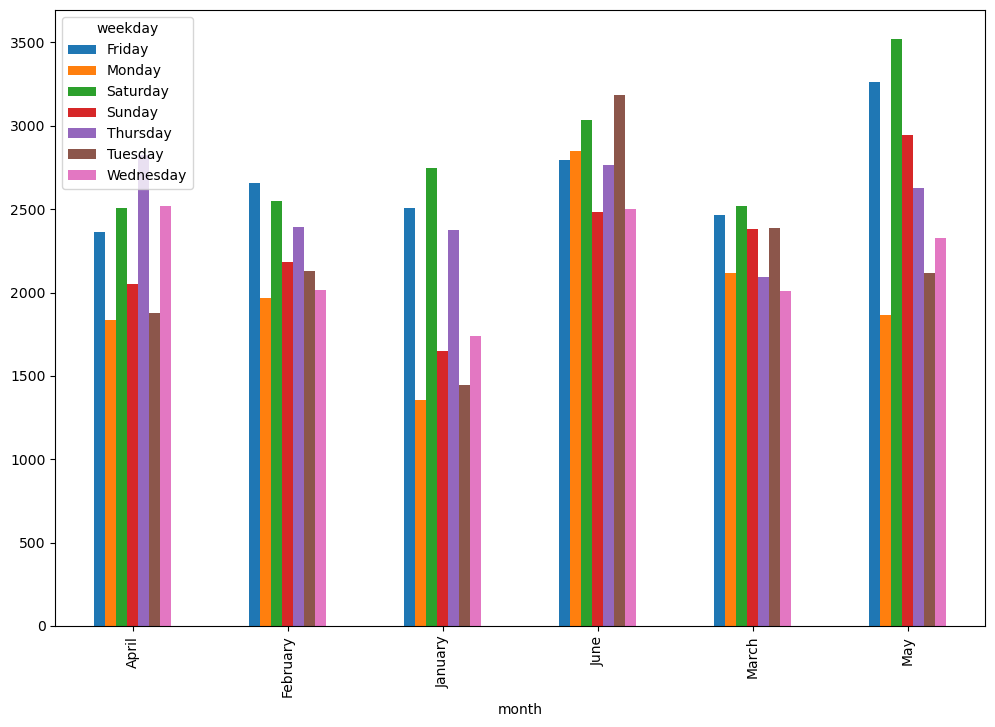
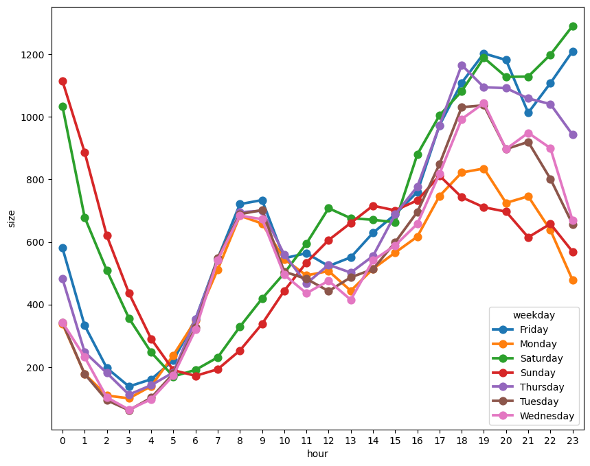

```python
# Download relevant libraries:
import pandas as pd
import numpy as np
import seaborn as sns
import matplotlib.pyplot as plt
!pip install --upgrade jedi==0.18.0
```

    Collecting jedi==0.18.0
      Downloading jedi-0.18.0-py2.py3-none-any.whl.metadata (20 kB)
    Collecting parso<0.9.0,>=0.8.0 (from jedi==0.18.0)
      Downloading parso-0.8.4-py2.py3-none-any.whl.metadata (7.7 kB)
    Downloading jedi-0.18.0-py2.py3-none-any.whl (1.4 MB)
       ━━━━━━━━━━━━━━━━━━━━━━━━━━━━━━━━━━━━━━━━ 1.4/1.4 MB 11.6 MB/s eta 0:00:0000:0100:01
    [?25hDownloading parso-0.8.4-py2.py3-none-any.whl (103 kB)
       ━━━━━━━━━━━━━━━━━━━━━━━━━━━━━━━━━━━━━━━━ 103.7/103.7 kB 10.0 MB/s eta 0:00:00
    [?25hInstalling collected packages: parso, jedi
      Attempting uninstall: parso
        Found existing installation: parso 0.7.1
        Uninstalling parso-0.7.1:
          Successfully uninstalled parso-0.7.1
      Attempting uninstall: jedi
        Found existing installation: jedi 0.17.2
        Uninstalling jedi-0.17.2:
          Successfully uninstalled jedi-0.17.2
    Successfully installed jedi-0.18.0 parso-0.8.4


```python
import os
```


```python
# Access list of files:
os.listdir(r"/Users/munira/Documents/Datasets")
```


    ['other-Lyft_B02510.csv',
     'other-FHV-services_jan-aug-2015.csv',
     'other-Firstclass_B01536.csv',
     'other-Skyline_B00111.csv',
     'uber-raw-data-janjune-15_sample.csv',
     'uber-raw-data-janjune-15.csv',
     'other-American_B01362.csv',
     'uber-raw-data-apr14.csv',
     'Uber-Jan-Feb-FOIL.csv',
     'other-Highclass_B01717.csv',
     'uber-raw-data-aug14.csv',
     'uber-raw-data-sep14.csv',
     'uber-raw-data-jul14.csv',
     'other-Federal_02216.csv',
     'uber-raw-data-jun14.csv',
     'other-Carmel_B00256.csv',
     'other-Diplo_B01196.csv',
     'other-Dial7_B00887.csv',
     'uber-raw-data-may14.csv',
     'other-Prestige_B01338.csv']


```python
# Access specific file:
uber_15 = pd.read_csv(r"/Users/munira/Documents/Datasets/uber-raw-data-janjune-15_sample.csv")
```


```python
uber_15.shape
```


    (100000, 4)


```python
type(uber_15)
```


    pandas.core.frame.DataFrame


```python
# Find number of duplicates
uber_15.duplicated().sum()
```


    54


```python
# Remove duplicates:
uber_15.drop_duplicates(inplace=True)
```


```python
# Check to be sure duplicates have been removed:
uber_15.duplicated().sum()
```


    0


```python
uber_15.shape
```


    (99946, 4)


```python
# Find data types of attributes:
uber_15.dtypes
```


    Dispatching_base_num    object
    Pickup_date             object
    Affiliated_base_num     object
    locationID               int64
    dtype: object


```python
#Find number of nulls:
uber_15.isnull().sum()
```


    Dispatching_base_num       0
    Pickup_date                0
    Affiliated_base_num     1116
    locationID                 0
    dtype: int64


```python
uber_15['Pickup_date']
```


    0        2015-05-02 21:43:00
    1        2015-01-20 19:52:59
    2        2015-03-19 20:26:00
    3        2015-04-10 17:38:00
    4        2015-03-23 07:03:00
                    ...         
    99995    2015-04-13 16:12:00
    99996    2015-03-06 21:32:00
    99997    2015-03-19 19:56:00
    99998    2015-05-02 16:02:00
    99999    2015-06-24 16:04:00
    Name: Pickup_date, Length: 99946, dtype: object


```python
type(uber_15['Pickup_date'][0])
```


    str


```python
uber_15['Pickup_date'] = pd.to_datetime(uber_15['Pickup_date'])
```


```python
uber_15['Pickup_date'].dtype
```


    dtype('<M8[ns]')


```python
uber_15['Pickup_date'][0]
```


    Timestamp('2015-05-02 21:43:00')


```python
type(uber_15['Pickup_date'][0])
```


    pandas._libs.tslibs.timestamps.Timestamp


```python
uber_15.dtypes
```


    Dispatching_base_num            object
    Pickup_date             datetime64[ns]
    Affiliated_base_num             object
    locationID                       int64
    dtype: object


```python
# Which month has the maximum number of Uber pickups?
# Currently pickup dates are stored in the dataset as numbers, so you must convert the numbers to month names using the code below:#

uber_15['month'] = uber_15['Pickup_date'].dt.month_name()
```


```python
uber_15['month']
```


    0            May
    1        January
    2          March
    3          April
    4          March
              ...   
    99995      April
    99996      March
    99997      March
    99998        May
    99999       June
    Name: month, Length: 99946, dtype: object


```python
# Number of instances/counts per month:
uber_15['month'].value_counts()
```


    month
    June        19620
    May         18660
    April       15982
    March       15969
    February    15896
    January     13819
    Name: count, dtype: int64


```python
# To display the above visually:
uber_15['month'].value_counts().plot()
```


    <Axes: xlabel='month'>


    

    


```python
uber_15['month'].value_counts().plot(kind='bar')
```


    <Axes: xlabel='month'>


    

    


```python
#To obtain the day number, day name, hour and minute:

uber_15['weekday'] = uber_15['Pickup_date'].dt.day_name()
uber_15['day'] = uber_15['Pickup_date'].dt.day
uber_15['hour'] = uber_15['Pickup_date'].dt.hour
uber_15['minute'] = uber_15['Pickup_date'].dt.minute
```


```python
# To display the top 4:

uber_15.head(4)
```


<div>
<style scoped>
    .dataframe tbody tr th:only-of-type {
        vertical-align: middle;
    }

    .dataframe tbody tr th {
        vertical-align: top;
    }

    .dataframe thead th {
        text-align: right;
    }
</style>
<table border="1" class="dataframe">
  <thead>
    <tr style="text-align: right;">
      <th></th>
      <th>Dispatching_base_num</th>
      <th>Pickup_date</th>
      <th>Affiliated_base_num</th>
      <th>locationID</th>
      <th>month</th>
      <th>weekday</th>
      <th>day</th>
      <th>minute</th>
      <th>hour</th>
    </tr>
  </thead>
  <tbody>
    <tr>
      <th>0</th>
      <td>B02617</td>
      <td>2015-05-02 21:43:00</td>
      <td>B02764</td>
      <td>237</td>
      <td>May</td>
      <td>Saturday</td>
      <td>2</td>
      <td>43</td>
      <td>21</td>
    </tr>
    <tr>
      <th>1</th>
      <td>B02682</td>
      <td>2015-01-20 19:52:59</td>
      <td>B02682</td>
      <td>231</td>
      <td>January</td>
      <td>Tuesday</td>
      <td>20</td>
      <td>52</td>
      <td>19</td>
    </tr>
    <tr>
      <th>2</th>
      <td>B02617</td>
      <td>2015-03-19 20:26:00</td>
      <td>B02617</td>
      <td>161</td>
      <td>March</td>
      <td>Thursday</td>
      <td>19</td>
      <td>26</td>
      <td>20</td>
    </tr>
    <tr>
      <th>3</th>
      <td>B02764</td>
      <td>2015-04-10 17:38:00</td>
      <td>B02764</td>
      <td>107</td>
      <td>April</td>
      <td>Friday</td>
      <td>10</td>
      <td>38</td>
      <td>17</td>
    </tr>
  </tbody>
</table>
</div>


```python
#To display crosstabular / pivot table containing month and weekday:

pd.crosstab(index=uber_15['month'],columns=uber_15['weekday'])
```


<div>
<style scoped>
    .dataframe tbody tr th:only-of-type {
        vertical-align: middle;
    }

    .dataframe tbody tr th {
        vertical-align: top;
    }

    .dataframe thead th {
        text-align: right;
    }
</style>
<table border="1" class="dataframe">
  <thead>
    <tr style="text-align: right;">
      <th>weekday</th>
      <th>Friday</th>
      <th>Monday</th>
      <th>Saturday</th>
      <th>Sunday</th>
      <th>Thursday</th>
      <th>Tuesday</th>
      <th>Wednesday</th>
    </tr>
    <tr>
      <th>month</th>
      <th></th>
      <th></th>
      <th></th>
      <th></th>
      <th></th>
      <th></th>
      <th></th>
    </tr>
  </thead>
  <tbody>
    <tr>
      <th>April</th>
      <td>2365</td>
      <td>1833</td>
      <td>2508</td>
      <td>2052</td>
      <td>2823</td>
      <td>1880</td>
      <td>2521</td>
    </tr>
    <tr>
      <th>February</th>
      <td>2655</td>
      <td>1970</td>
      <td>2550</td>
      <td>2183</td>
      <td>2396</td>
      <td>2129</td>
      <td>2013</td>
    </tr>
    <tr>
      <th>January</th>
      <td>2508</td>
      <td>1353</td>
      <td>2745</td>
      <td>1651</td>
      <td>2378</td>
      <td>1444</td>
      <td>1740</td>
    </tr>
    <tr>
      <th>June</th>
      <td>2793</td>
      <td>2848</td>
      <td>3037</td>
      <td>2485</td>
      <td>2767</td>
      <td>3187</td>
      <td>2503</td>
    </tr>
    <tr>
      <th>March</th>
      <td>2465</td>
      <td>2115</td>
      <td>2522</td>
      <td>2379</td>
      <td>2093</td>
      <td>2388</td>
      <td>2007</td>
    </tr>
    <tr>
      <th>May</th>
      <td>3262</td>
      <td>1865</td>
      <td>3519</td>
      <td>2944</td>
      <td>2627</td>
      <td>2115</td>
      <td>2328</td>
    </tr>
  </tbody>
</table>
</div>


```python
#To assign the object 'pivot' to the above function:

pivot = pd.crosstab(index=uber_15['month'],columns=uber_15['weekday'])
```


```python
pivot
```


<div>
<style scoped>
    .dataframe tbody tr th:only-of-type {
        vertical-align: middle;
    }

    .dataframe tbody tr th {
        vertical-align: top;
    }

    .dataframe thead th {
        text-align: right;
    }
</style>
<table border="1" class="dataframe">
  <thead>
    <tr style="text-align: right;">
      <th>weekday</th>
      <th>Friday</th>
      <th>Monday</th>
      <th>Saturday</th>
      <th>Sunday</th>
      <th>Thursday</th>
      <th>Tuesday</th>
      <th>Wednesday</th>
    </tr>
    <tr>
      <th>month</th>
      <th></th>
      <th></th>
      <th></th>
      <th></th>
      <th></th>
      <th></th>
      <th></th>
    </tr>
  </thead>
  <tbody>
    <tr>
      <th>April</th>
      <td>2365</td>
      <td>1833</td>
      <td>2508</td>
      <td>2052</td>
      <td>2823</td>
      <td>1880</td>
      <td>2521</td>
    </tr>
    <tr>
      <th>February</th>
      <td>2655</td>
      <td>1970</td>
      <td>2550</td>
      <td>2183</td>
      <td>2396</td>
      <td>2129</td>
      <td>2013</td>
    </tr>
    <tr>
      <th>January</th>
      <td>2508</td>
      <td>1353</td>
      <td>2745</td>
      <td>1651</td>
      <td>2378</td>
      <td>1444</td>
      <td>1740</td>
    </tr>
    <tr>
      <th>June</th>
      <td>2793</td>
      <td>2848</td>
      <td>3037</td>
      <td>2485</td>
      <td>2767</td>
      <td>3187</td>
      <td>2503</td>
    </tr>
    <tr>
      <th>March</th>
      <td>2465</td>
      <td>2115</td>
      <td>2522</td>
      <td>2379</td>
      <td>2093</td>
      <td>2388</td>
      <td>2007</td>
    </tr>
    <tr>
      <th>May</th>
      <td>3262</td>
      <td>1865</td>
      <td>3519</td>
      <td>2944</td>
      <td>2627</td>
      <td>2115</td>
      <td>2328</td>
    </tr>
  </tbody>
</table>
</div>


```python
pivot.plot(kind='bar' , figsize=(12,8))
```


    <Axes: xlabel='month'>


    

    


```python
#Find out when rush hour occurs in NYC on all days

#Step 1: find the number of bookings/pickups per hour per day and display this in a dataframe (rows/columns:

summary = uber_15.groupby(['weekday','hour'] , as_index=False).size()

```


```python
summary
```


<div>
<style scoped>
    .dataframe tbody tr th:only-of-type {
        vertical-align: middle;
    }

    .dataframe tbody tr th {
        vertical-align: top;
    }

    .dataframe thead th {
        text-align: right;
    }
</style>
<table border="1" class="dataframe">
  <thead>
    <tr style="text-align: right;">
      <th></th>
      <th>weekday</th>
      <th>hour</th>
      <th>size</th>
    </tr>
  </thead>
  <tbody>
    <tr>
      <th>0</th>
      <td>Friday</td>
      <td>0</td>
      <td>581</td>
    </tr>
    <tr>
      <th>1</th>
      <td>Friday</td>
      <td>1</td>
      <td>333</td>
    </tr>
    <tr>
      <th>2</th>
      <td>Friday</td>
      <td>2</td>
      <td>197</td>
    </tr>
    <tr>
      <th>3</th>
      <td>Friday</td>
      <td>3</td>
      <td>138</td>
    </tr>
    <tr>
      <th>4</th>
      <td>Friday</td>
      <td>4</td>
      <td>161</td>
    </tr>
    <tr>
      <th>...</th>
      <td>...</td>
      <td>...</td>
      <td>...</td>
    </tr>
    <tr>
      <th>163</th>
      <td>Wednesday</td>
      <td>19</td>
      <td>1044</td>
    </tr>
    <tr>
      <th>164</th>
      <td>Wednesday</td>
      <td>20</td>
      <td>897</td>
    </tr>
    <tr>
      <th>165</th>
      <td>Wednesday</td>
      <td>21</td>
      <td>949</td>
    </tr>
    <tr>
      <th>166</th>
      <td>Wednesday</td>
      <td>22</td>
      <td>900</td>
    </tr>
    <tr>
      <th>167</th>
      <td>Wednesday</td>
      <td>23</td>
      <td>669</td>
    </tr>
  </tbody>
</table>
<p>168 rows × 3 columns</p>
</div>


```python
plt.figure(figsize=(10,8))
sns.pointplot(x="hour" , y="size" , hue= "weekday", data=summary)
```


    <Axes: xlabel='hour', ylabel='size'>


    

    


```python
#Which Uber base-number has the most active vehicles?


```


<div>
<style scoped>
    .dataframe tbody tr th:only-of-type {
        vertical-align: middle;
    }

    .dataframe tbody tr th {
        vertical-align: top;
    }

    .dataframe thead th {
        text-align: right;
    }
</style>
<table border="1" class="dataframe">
  <thead>
    <tr style="text-align: right;">
      <th></th>
      <th>weekday</th>
      <th>hour</th>
      <th>size</th>
    </tr>
  </thead>
  <tbody>
    <tr>
      <th>0</th>
      <td>Friday</td>
      <td>0</td>
      <td>581</td>
    </tr>
    <tr>
      <th>1</th>
      <td>Friday</td>
      <td>1</td>
      <td>333</td>
    </tr>
    <tr>
      <th>2</th>
      <td>Friday</td>
      <td>2</td>
      <td>197</td>
    </tr>
    <tr>
      <th>3</th>
      <td>Friday</td>
      <td>3</td>
      <td>138</td>
    </tr>
    <tr>
      <th>4</th>
      <td>Friday</td>
      <td>4</td>
      <td>161</td>
    </tr>
    <tr>
      <th>...</th>
      <td>...</td>
      <td>...</td>
      <td>...</td>
    </tr>
    <tr>
      <th>163</th>
      <td>Wednesday</td>
      <td>19</td>
      <td>1044</td>
    </tr>
    <tr>
      <th>164</th>
      <td>Wednesday</td>
      <td>20</td>
      <td>897</td>
    </tr>
    <tr>
      <th>165</th>
      <td>Wednesday</td>
      <td>21</td>
      <td>949</td>
    </tr>
    <tr>
      <th>166</th>
      <td>Wednesday</td>
      <td>22</td>
      <td>900</td>
    </tr>
    <tr>
      <th>167</th>
      <td>Wednesday</td>
      <td>23</td>
      <td>669</td>
    </tr>
  </tbody>
</table>
<p>168 rows × 3 columns</p>
</div>


```python
os.listdir(r"/Users/munira/Documents/Datasets")
```


    ['other-Lyft_B02510.csv',
     'other-FHV-services_jan-aug-2015.csv',
     'other-Firstclass_B01536.csv',
     'other-Skyline_B00111.csv',
     'uber-raw-data-janjune-15_sample.csv',
     'uber-raw-data-janjune-15.csv',
     'other-American_B01362.csv',
     'uber-raw-data-apr14.csv',
     'Uber-Jan-Feb-FOIL.csv',
     'other-Highclass_B01717.csv',
     'uber-raw-data-aug14.csv',
     'uber-raw-data-sep14.csv',
     'uber-raw-data-jul14.csv',
     'other-Federal_02216.csv',
     'uber-raw-data-jun14.csv',
     'other-Carmel_B00256.csv',
     'other-Diplo_B01196.csv',
     'other-Dial7_B00887.csv',
     'uber-raw-data-may14.csv',
     'other-Prestige_B01338.csv']


```python
uber_foil = pd.read_csv(r"/Users/munira/Documents/Datasets/Uber-Jan-Feb-FOIL.csv")
```


```python
uber_foil.shape
```


    (354, 4)


```python
uber_foil.head(3)
```


<div>
<style scoped>
    .dataframe tbody tr th:only-of-type {
        vertical-align: middle;
    }

    .dataframe tbody tr th {
        vertical-align: top;
    }

    .dataframe thead th {
        text-align: right;
    }
</style>
<table border="1" class="dataframe">
  <thead>
    <tr style="text-align: right;">
      <th></th>
      <th>dispatching_base_number</th>
      <th>date</th>
      <th>active_vehicles</th>
      <th>trips</th>
    </tr>
  </thead>
  <tbody>
    <tr>
      <th>0</th>
      <td>B02512</td>
      <td>1/1/2015</td>
      <td>190</td>
      <td>1132</td>
    </tr>
    <tr>
      <th>1</th>
      <td>B02765</td>
      <td>1/1/2015</td>
      <td>225</td>
      <td>1765</td>
    </tr>
    <tr>
      <th>2</th>
      <td>B02764</td>
      <td>1/1/2015</td>
      <td>3427</td>
      <td>29421</td>
    </tr>
  </tbody>
</table>
</div>


```python
!pip install chart_studio
!pip install plotly
```

    Collecting chart_studio
      Downloading chart_studio-1.1.0-py3-none-any.whl.metadata (1.3 kB)
    Requirement already satisfied: plotly in /opt/anaconda3/lib/python3.12/site-packages (from chart_studio) (5.22.0)
    Requirement already satisfied: requests in /opt/anaconda3/lib/python3.12/site-packages (from chart_studio) (2.32.2)
    Collecting retrying>=1.3.3 (from chart_studio)
      Downloading retrying-1.3.4-py3-none-any.whl.metadata (6.9 kB)
    Requirement already satisfied: six in /opt/anaconda3/lib/python3.12/site-packages (from chart_studio) (1.16.0)
    Requirement already satisfied: tenacity>=6.2.0 in /opt/anaconda3/lib/python3.12/site-packages (from plotly->chart_studio) (8.2.2)
    Requirement already satisfied: packaging in /opt/anaconda3/lib/python3.12/site-packages (from plotly->chart_studio) (23.2)
    Requirement already satisfied: charset-normalizer<4,>=2 in /opt/anaconda3/lib/python3.12/site-packages (from requests->chart_studio) (2.0.4)
    Requirement already satisfied: idna<4,>=2.5 in /opt/anaconda3/lib/python3.12/site-packages (from requests->chart_studio) (3.7)
    Requirement already satisfied: urllib3<3,>=1.21.1 in /opt/anaconda3/lib/python3.12/site-packages (from requests->chart_studio) (2.2.2)
    Requirement already satisfied: certifi>=2017.4.17 in /opt/anaconda3/lib/python3.12/site-packages (from requests->chart_studio) (2024.7.4)
    Downloading chart_studio-1.1.0-py3-none-any.whl (64 kB)
       ━━━━━━━━━━━━━━━━━━━━━━━━━━━━━━━━━━━━━━━━ 64.4/64.4 kB 3.2 MB/s eta 0:00:00
    [?25hDownloading retrying-1.3.4-py3-none-any.whl (11 kB)
    Installing collected packages: retrying, chart_studio
    Successfully installed chart_studio-1.1.0 retrying-1.3.4
    Requirement already satisfied: plotly in /opt/anaconda3/lib/python3.12/site-packages (5.22.0)
    Requirement already satisfied: tenacity>=6.2.0 in /opt/anaconda3/lib/python3.12/site-packages (from plotly) (8.2.2)
    Requirement already satisfied: packaging in /opt/anaconda3/lib/python3.12/site-packages (from plotly) (23.2)


```python
#You need a boxplot for the next part:

import chart_studio.plotly as py
import plotly.graph_objs as go
import plotly.express as px

from plotly.offline import download_plotlyjs , init_notebook_mode , plot , iplot
```


```python
init_notebook_mode(connected=True)
```


<script type="text/javascript">
window.PlotlyConfig = {MathJaxConfig: 'local'};
if (window.MathJax && window.MathJax.Hub && window.MathJax.Hub.Config) {window.MathJax.Hub.Config({SVG: {font: "STIX-Web"}});}
if (typeof require !== 'undefined') {
require.undef("plotly");
requirejs.config({
    paths: {
        'plotly': ['https://cdn.plot.ly/plotly-2.32.0.min']
    }
});
require(['plotly'], function(Plotly) {
    window._Plotly = Plotly;
});
}
</script>


```python
px.box(x='dispatching_base_number' , y='active_vehicles' , data_frame=uber_foil)
```


<div>                            <div id="3a42399a-ddd1-4977-80b7-ad250af5aa99" class="plotly-graph-div" style="height:525px; width:100%;"></div>            <script type="text/javascript">                require(["plotly"], function(Plotly) {                    window.PLOTLYENV=window.PLOTLYENV || {};                                    if (document.getElementById("3a42399a-ddd1-4977-80b7-ad250af5aa99")) {                    Plotly.newPlot(                        "3a42399a-ddd1-4977-80b7-ad250af5aa99",                        [{"alignmentgroup":"True","hovertemplate":"dispatching_base_number=%{x}\u003cbr\u003eactive_vehicles=%{y}\u003cextra\u003e\u003c\u002fextra\u003e","legendgroup":"","marker":{"color":"#636efa"},"name":"","notched":false,"offsetgroup":"","orientation":"v","showlegend":false,"x":["B02512","B02765","B02764","B02682","B02617","B02598","B02598","B02617","B02512","B02682","B02765","B02764","B02765","B02617","B02598","B02682","B02512","B02764","B02512","B02682","B02598","B02765","B02617","B02764","B02512","B02682","B02617","B02764","B02598","B02765","B02764","B02682","B02617","B02765","B02512","B02598","B02617","B02682","B02764","B02765","B02512","B02598","B02765","B02598","B02512","B02682","B02764","B02617","B02617","B02512","B02764","B02682","B02598","B02765","B02682","B02617","B02598","B02512","B02764","B02765","B02765","B02598","B02682","B02764","B02617","B02512","B02764","B02765","B02512","B02598","B02682","B02617","B02765","B02598","B02617","B02512","B02764","B02682","B02764","B02765","B02598","B02512","B02617","B02682","B02512","B02682","B02617","B02765","B02764","B02598","B02617","B02765","B02764","B02682","B02512","B02598","B02598","B02512","B02682","B02765","B02617","B02764","B02512","B02598","B02765","B02764","B02682","B02617","B02682","B02617","B02765","B02764","B02512","B02598","B02598","B02682","B02512","B02764","B02765","B02617","B02764","B02512","B02682","B02598","B02765","B02617","B02617","B02764","B02512","B02598","B02682","B02765","B02598","B02512","B02765","B02764","B02617","B02682","B02598","B02764","B02512","B02617","B02682","B02765","B02512","B02764","B02765","B02598","B02682","B02617","B02617","B02598","B02765","B02764","B02682","B02512","B02682","B02765","B02617","B02598","B02512","B02764","B02764","B02682","B02765","B02617","B02598","B02512","B02617","B02764","B02682","B02765","B02512","B02598","B02512","B02617","B02682","B02764","B02765","B02598","B02765","B02512","B02617","B02682","B02764","B02598","B02598","B02682","B02512","B02765","B02617","B02764","B02617","B02682","B02765","B02598","B02764","B02512","B02765","B02598","B02512","B02764","B02617","B02682","B02764","B02765","B02512","B02682","B02617","B02598","B02617","B02682","B02598","B02512","B02765","B02764","B02617","B02765","B02598","B02512","B02764","B02682","B02598","B02512","B02617","B02682","B02764","B02765","B02764","B02765","B02598","B02617","B02682","B02512","B02617","B02682","B02598","B02764","B02512","B02765","B02764","B02512","B02617","B02765","B02682","B02598","B02617","B02764","B02512","B02598","B02765","B02682","B02617","B02512","B02682","B02765","B02598","B02764","B02617","B02682","B02764","B02765","B02512","B02598","B02764","B02512","B02598","B02765","B02617","B02682","B02682","B02764","B02617","B02765","B02512","B02598","B02598","B02512","B02617","B02764","B02682","B02765","B02764","B02512","B02682","B02617","B02598","B02765","B02598","B02682","B02617","B02765","B02764","B02512","B02598","B02512","B02682","B02764","B02765","B02617","B02764","B02617","B02598","B02682","B02765","B02512","B02598","B02682","B02765","B02617","B02512","B02764","B02512","B02617","B02682","B02764","B02598","B02765","B02598","B02617","B02764","B02682","B02765","B02512","B02764","B02512","B02598","B02682","B02617","B02765","B02512","B02598","B02765","B02682","B02617","B02764","B02598","B02617","B02682","B02512","B02765","B02764","B02765","B02617","B02598","B02512","B02764","B02682","B02598","B02764","B02617","B02682","B02512","B02765"],"x0":" ","xaxis":"x","y":[190,225,3427,945,1228,870,785,1137,175,890,196,3147,201,1188,818,915,173,3215,147,812,746,183,1088,2862,194,951,1218,3387,907,227,3473,1022,1336,234,218,933,1363,1039,3603,248,217,974,262,1070,238,1135,3831,1463,1455,224,3820,1140,1070,280,1057,1331,949,206,3558,245,220,832,943,3186,1228,162,3499,279,217,964,1082,1323,258,975,1342,234,3658,1092,3736,271,1030,233,1405,1174,237,1208,1457,270,3840,1068,1445,290,3975,1250,234,1079,974,201,1137,252,1306,3657,177,869,248,3290,1056,1223,883,992,238,2958,168,706,944,1151,221,3654,272,1350,3718,242,1228,1035,296,1429,1471,3889,246,1071,1295,295,1093,246,299,4040,1482,1330,945,3652,211,1367,1223,245,183,3300,226,829,1046,1203,1150,860,230,3012,1084,197,600,135,596,434,112,1619,3692,1235,286,1356,1011,235,1474,3959,1316,295,250,1082,256,1501,1384,4124,322,1106,309,225,1394,1321,3947,1027,961,1214,193,289,1355,3740,1217,1152,275,939,3270,227,299,991,257,3674,1350,1269,3856,309,244,1311,1393,1072,1524,1418,1179,264,355,4093,1526,385,1181,261,4170,1414,1031,211,1383,1300,3849,345,3422,313,923,1256,1136,176,1312,1241,976,3543,228,388,3700,233,1364,422,1281,1029,1450,3849,255,1115,450,1396,1532,269,1468,536,1181,4137,1590,1523,4395,599,281,1216,4129,236,1111,583,1486,1428,1261,3651,1293,521,210,1003,934,207,1214,3524,1164,508,3826,241,1314,1378,1066,578,1078,1314,1394,586,3842,228,1127,250,1428,4110,663,1452,4384,1574,1186,1497,736,272,1044,1374,685,1443,238,3981,199,1248,1220,3478,909,566,966,1332,3734,1262,665,238,3965,247,1061,1346,1456,698,246,1076,706,1395,1473,3934,1134,1539,1465,243,745,4101,786,1551,1114,272,4253,1510,994,3952,1372,1386,230,747],"y0":" ","yaxis":"y","type":"box"}],                        {"template":{"data":{"histogram2dcontour":[{"type":"histogram2dcontour","colorbar":{"outlinewidth":0,"ticks":""},"colorscale":[[0.0,"#0d0887"],[0.1111111111111111,"#46039f"],[0.2222222222222222,"#7201a8"],[0.3333333333333333,"#9c179e"],[0.4444444444444444,"#bd3786"],[0.5555555555555556,"#d8576b"],[0.6666666666666666,"#ed7953"],[0.7777777777777778,"#fb9f3a"],[0.8888888888888888,"#fdca26"],[1.0,"#f0f921"]]}],"choropleth":[{"type":"choropleth","colorbar":{"outlinewidth":0,"ticks":""}}],"histogram2d":[{"type":"histogram2d","colorbar":{"outlinewidth":0,"ticks":""},"colorscale":[[0.0,"#0d0887"],[0.1111111111111111,"#46039f"],[0.2222222222222222,"#7201a8"],[0.3333333333333333,"#9c179e"],[0.4444444444444444,"#bd3786"],[0.5555555555555556,"#d8576b"],[0.6666666666666666,"#ed7953"],[0.7777777777777778,"#fb9f3a"],[0.8888888888888888,"#fdca26"],[1.0,"#f0f921"]]}],"heatmap":[{"type":"heatmap","colorbar":{"outlinewidth":0,"ticks":""},"colorscale":[[0.0,"#0d0887"],[0.1111111111111111,"#46039f"],[0.2222222222222222,"#7201a8"],[0.3333333333333333,"#9c179e"],[0.4444444444444444,"#bd3786"],[0.5555555555555556,"#d8576b"],[0.6666666666666666,"#ed7953"],[0.7777777777777778,"#fb9f3a"],[0.8888888888888888,"#fdca26"],[1.0,"#f0f921"]]}],"heatmapgl":[{"type":"heatmapgl","colorbar":{"outlinewidth":0,"ticks":""},"colorscale":[[0.0,"#0d0887"],[0.1111111111111111,"#46039f"],[0.2222222222222222,"#7201a8"],[0.3333333333333333,"#9c179e"],[0.4444444444444444,"#bd3786"],[0.5555555555555556,"#d8576b"],[0.6666666666666666,"#ed7953"],[0.7777777777777778,"#fb9f3a"],[0.8888888888888888,"#fdca26"],[1.0,"#f0f921"]]}],"contourcarpet":[{"type":"contourcarpet","colorbar":{"outlinewidth":0,"ticks":""}}],"contour":[{"type":"contour","colorbar":{"outlinewidth":0,"ticks":""},"colorscale":[[0.0,"#0d0887"],[0.1111111111111111,"#46039f"],[0.2222222222222222,"#7201a8"],[0.3333333333333333,"#9c179e"],[0.4444444444444444,"#bd3786"],[0.5555555555555556,"#d8576b"],[0.6666666666666666,"#ed7953"],[0.7777777777777778,"#fb9f3a"],[0.8888888888888888,"#fdca26"],[1.0,"#f0f921"]]}],"surface":[{"type":"surface","colorbar":{"outlinewidth":0,"ticks":""},"colorscale":[[0.0,"#0d0887"],[0.1111111111111111,"#46039f"],[0.2222222222222222,"#7201a8"],[0.3333333333333333,"#9c179e"],[0.4444444444444444,"#bd3786"],[0.5555555555555556,"#d8576b"],[0.6666666666666666,"#ed7953"],[0.7777777777777778,"#fb9f3a"],[0.8888888888888888,"#fdca26"],[1.0,"#f0f921"]]}],"mesh3d":[{"type":"mesh3d","colorbar":{"outlinewidth":0,"ticks":""}}],"scatter":[{"fillpattern":{"fillmode":"overlay","size":10,"solidity":0.2},"type":"scatter"}],"parcoords":[{"type":"parcoords","line":{"colorbar":{"outlinewidth":0,"ticks":""}}}],"scatterpolargl":[{"type":"scatterpolargl","marker":{"colorbar":{"outlinewidth":0,"ticks":""}}}],"bar":[{"error_x":{"color":"#2a3f5f"},"error_y":{"color":"#2a3f5f"},"marker":{"line":{"color":"#E5ECF6","width":0.5},"pattern":{"fillmode":"overlay","size":10,"solidity":0.2}},"type":"bar"}],"scattergeo":[{"type":"scattergeo","marker":{"colorbar":{"outlinewidth":0,"ticks":""}}}],"scatterpolar":[{"type":"scatterpolar","marker":{"colorbar":{"outlinewidth":0,"ticks":""}}}],"histogram":[{"marker":{"pattern":{"fillmode":"overlay","size":10,"solidity":0.2}},"type":"histogram"}],"scattergl":[{"type":"scattergl","marker":{"colorbar":{"outlinewidth":0,"ticks":""}}}],"scatter3d":[{"type":"scatter3d","line":{"colorbar":{"outlinewidth":0,"ticks":""}},"marker":{"colorbar":{"outlinewidth":0,"ticks":""}}}],"scattermapbox":[{"type":"scattermapbox","marker":{"colorbar":{"outlinewidth":0,"ticks":""}}}],"scatterternary":[{"type":"scatterternary","marker":{"colorbar":{"outlinewidth":0,"ticks":""}}}],"scattercarpet":[{"type":"scattercarpet","marker":{"colorbar":{"outlinewidth":0,"ticks":""}}}],"carpet":[{"aaxis":{"endlinecolor":"#2a3f5f","gridcolor":"white","linecolor":"white","minorgridcolor":"white","startlinecolor":"#2a3f5f"},"baxis":{"endlinecolor":"#2a3f5f","gridcolor":"white","linecolor":"white","minorgridcolor":"white","startlinecolor":"#2a3f5f"},"type":"carpet"}],"table":[{"cells":{"fill":{"color":"#EBF0F8"},"line":{"color":"white"}},"header":{"fill":{"color":"#C8D4E3"},"line":{"color":"white"}},"type":"table"}],"barpolar":[{"marker":{"line":{"color":"#E5ECF6","width":0.5},"pattern":{"fillmode":"overlay","size":10,"solidity":0.2}},"type":"barpolar"}],"pie":[{"automargin":true,"type":"pie"}]},"layout":{"autotypenumbers":"strict","colorway":["#636efa","#EF553B","#00cc96","#ab63fa","#FFA15A","#19d3f3","#FF6692","#B6E880","#FF97FF","#FECB52"],"font":{"color":"#2a3f5f"},"hovermode":"closest","hoverlabel":{"align":"left"},"paper_bgcolor":"white","plot_bgcolor":"#E5ECF6","polar":{"bgcolor":"#E5ECF6","angularaxis":{"gridcolor":"white","linecolor":"white","ticks":""},"radialaxis":{"gridcolor":"white","linecolor":"white","ticks":""}},"ternary":{"bgcolor":"#E5ECF6","aaxis":{"gridcolor":"white","linecolor":"white","ticks":""},"baxis":{"gridcolor":"white","linecolor":"white","ticks":""},"caxis":{"gridcolor":"white","linecolor":"white","ticks":""}},"coloraxis":{"colorbar":{"outlinewidth":0,"ticks":""}},"colorscale":{"sequential":[[0.0,"#0d0887"],[0.1111111111111111,"#46039f"],[0.2222222222222222,"#7201a8"],[0.3333333333333333,"#9c179e"],[0.4444444444444444,"#bd3786"],[0.5555555555555556,"#d8576b"],[0.6666666666666666,"#ed7953"],[0.7777777777777778,"#fb9f3a"],[0.8888888888888888,"#fdca26"],[1.0,"#f0f921"]],"sequentialminus":[[0.0,"#0d0887"],[0.1111111111111111,"#46039f"],[0.2222222222222222,"#7201a8"],[0.3333333333333333,"#9c179e"],[0.4444444444444444,"#bd3786"],[0.5555555555555556,"#d8576b"],[0.6666666666666666,"#ed7953"],[0.7777777777777778,"#fb9f3a"],[0.8888888888888888,"#fdca26"],[1.0,"#f0f921"]],"diverging":[[0,"#8e0152"],[0.1,"#c51b7d"],[0.2,"#de77ae"],[0.3,"#f1b6da"],[0.4,"#fde0ef"],[0.5,"#f7f7f7"],[0.6,"#e6f5d0"],[0.7,"#b8e186"],[0.8,"#7fbc41"],[0.9,"#4d9221"],[1,"#276419"]]},"xaxis":{"gridcolor":"white","linecolor":"white","ticks":"","title":{"standoff":15},"zerolinecolor":"white","automargin":true,"zerolinewidth":2},"yaxis":{"gridcolor":"white","linecolor":"white","ticks":"","title":{"standoff":15},"zerolinecolor":"white","automargin":true,"zerolinewidth":2},"scene":{"xaxis":{"backgroundcolor":"#E5ECF6","gridcolor":"white","linecolor":"white","showbackground":true,"ticks":"","zerolinecolor":"white","gridwidth":2},"yaxis":{"backgroundcolor":"#E5ECF6","gridcolor":"white","linecolor":"white","showbackground":true,"ticks":"","zerolinecolor":"white","gridwidth":2},"zaxis":{"backgroundcolor":"#E5ECF6","gridcolor":"white","linecolor":"white","showbackground":true,"ticks":"","zerolinecolor":"white","gridwidth":2}},"shapedefaults":{"line":{"color":"#2a3f5f"}},"annotationdefaults":{"arrowcolor":"#2a3f5f","arrowhead":0,"arrowwidth":1},"geo":{"bgcolor":"white","landcolor":"#E5ECF6","subunitcolor":"white","showland":true,"showlakes":true,"lakecolor":"white"},"title":{"x":0.05},"mapbox":{"style":"light"}}},"xaxis":{"anchor":"y","domain":[0.0,1.0],"title":{"text":"dispatching_base_number"}},"yaxis":{"anchor":"x","domain":[0.0,1.0],"title":{"text":"active_vehicles"}},"legend":{"tracegroupgap":0},"margin":{"t":60},"boxmode":"group"},                        {"responsive": true}                    ).then(function(){

var gd = document.getElementById('3a42399a-ddd1-4977-80b7-ad250af5aa99');
var x = new MutationObserver(function (mutations, observer) {{
        var display = window.getComputedStyle(gd).display;
        if (!display || display === 'none') {{
            console.log([gd, 'removed!']);
            Plotly.purge(gd);
            observer.disconnect();
        }}
}});

// Listen for the removal of the full notebook cells
var notebookContainer = gd.closest('#notebook-container');
if (notebookContainer) {{
    x.observe(notebookContainer, {childList: true});
}}

// Listen for the clearing of the current output cell
var outputEl = gd.closest('.output');
if (outputEl) {{
    x.observe(outputEl, {childList: true});
}}

                        })                };                });            </script>        </div>


```python
#To show how number of active_vehicles are distributed for each dispatching_base_number:

px.violin(x='dispatching_base_number' , y='active_vehicles' , data_frame=uber_foil)
```


<div>                            <div id="b91f7dda-e508-4b89-89e7-4f3a13bdf56d" class="plotly-graph-div" style="height:525px; width:100%;"></div>            <script type="text/javascript">                require(["plotly"], function(Plotly) {                    window.PLOTLYENV=window.PLOTLYENV || {};                                    if (document.getElementById("b91f7dda-e508-4b89-89e7-4f3a13bdf56d")) {                    Plotly.newPlot(                        "b91f7dda-e508-4b89-89e7-4f3a13bdf56d",                        [{"alignmentgroup":"True","box":{"visible":false},"hovertemplate":"dispatching_base_number=%{x}\u003cbr\u003eactive_vehicles=%{y}\u003cextra\u003e\u003c\u002fextra\u003e","legendgroup":"","marker":{"color":"#636efa"},"name":"","offsetgroup":"","orientation":"v","scalegroup":"True","showlegend":false,"x":["B02512","B02765","B02764","B02682","B02617","B02598","B02598","B02617","B02512","B02682","B02765","B02764","B02765","B02617","B02598","B02682","B02512","B02764","B02512","B02682","B02598","B02765","B02617","B02764","B02512","B02682","B02617","B02764","B02598","B02765","B02764","B02682","B02617","B02765","B02512","B02598","B02617","B02682","B02764","B02765","B02512","B02598","B02765","B02598","B02512","B02682","B02764","B02617","B02617","B02512","B02764","B02682","B02598","B02765","B02682","B02617","B02598","B02512","B02764","B02765","B02765","B02598","B02682","B02764","B02617","B02512","B02764","B02765","B02512","B02598","B02682","B02617","B02765","B02598","B02617","B02512","B02764","B02682","B02764","B02765","B02598","B02512","B02617","B02682","B02512","B02682","B02617","B02765","B02764","B02598","B02617","B02765","B02764","B02682","B02512","B02598","B02598","B02512","B02682","B02765","B02617","B02764","B02512","B02598","B02765","B02764","B02682","B02617","B02682","B02617","B02765","B02764","B02512","B02598","B02598","B02682","B02512","B02764","B02765","B02617","B02764","B02512","B02682","B02598","B02765","B02617","B02617","B02764","B02512","B02598","B02682","B02765","B02598","B02512","B02765","B02764","B02617","B02682","B02598","B02764","B02512","B02617","B02682","B02765","B02512","B02764","B02765","B02598","B02682","B02617","B02617","B02598","B02765","B02764","B02682","B02512","B02682","B02765","B02617","B02598","B02512","B02764","B02764","B02682","B02765","B02617","B02598","B02512","B02617","B02764","B02682","B02765","B02512","B02598","B02512","B02617","B02682","B02764","B02765","B02598","B02765","B02512","B02617","B02682","B02764","B02598","B02598","B02682","B02512","B02765","B02617","B02764","B02617","B02682","B02765","B02598","B02764","B02512","B02765","B02598","B02512","B02764","B02617","B02682","B02764","B02765","B02512","B02682","B02617","B02598","B02617","B02682","B02598","B02512","B02765","B02764","B02617","B02765","B02598","B02512","B02764","B02682","B02598","B02512","B02617","B02682","B02764","B02765","B02764","B02765","B02598","B02617","B02682","B02512","B02617","B02682","B02598","B02764","B02512","B02765","B02764","B02512","B02617","B02765","B02682","B02598","B02617","B02764","B02512","B02598","B02765","B02682","B02617","B02512","B02682","B02765","B02598","B02764","B02617","B02682","B02764","B02765","B02512","B02598","B02764","B02512","B02598","B02765","B02617","B02682","B02682","B02764","B02617","B02765","B02512","B02598","B02598","B02512","B02617","B02764","B02682","B02765","B02764","B02512","B02682","B02617","B02598","B02765","B02598","B02682","B02617","B02765","B02764","B02512","B02598","B02512","B02682","B02764","B02765","B02617","B02764","B02617","B02598","B02682","B02765","B02512","B02598","B02682","B02765","B02617","B02512","B02764","B02512","B02617","B02682","B02764","B02598","B02765","B02598","B02617","B02764","B02682","B02765","B02512","B02764","B02512","B02598","B02682","B02617","B02765","B02512","B02598","B02765","B02682","B02617","B02764","B02598","B02617","B02682","B02512","B02765","B02764","B02765","B02617","B02598","B02512","B02764","B02682","B02598","B02764","B02617","B02682","B02512","B02765"],"x0":" ","xaxis":"x","y":[190,225,3427,945,1228,870,785,1137,175,890,196,3147,201,1188,818,915,173,3215,147,812,746,183,1088,2862,194,951,1218,3387,907,227,3473,1022,1336,234,218,933,1363,1039,3603,248,217,974,262,1070,238,1135,3831,1463,1455,224,3820,1140,1070,280,1057,1331,949,206,3558,245,220,832,943,3186,1228,162,3499,279,217,964,1082,1323,258,975,1342,234,3658,1092,3736,271,1030,233,1405,1174,237,1208,1457,270,3840,1068,1445,290,3975,1250,234,1079,974,201,1137,252,1306,3657,177,869,248,3290,1056,1223,883,992,238,2958,168,706,944,1151,221,3654,272,1350,3718,242,1228,1035,296,1429,1471,3889,246,1071,1295,295,1093,246,299,4040,1482,1330,945,3652,211,1367,1223,245,183,3300,226,829,1046,1203,1150,860,230,3012,1084,197,600,135,596,434,112,1619,3692,1235,286,1356,1011,235,1474,3959,1316,295,250,1082,256,1501,1384,4124,322,1106,309,225,1394,1321,3947,1027,961,1214,193,289,1355,3740,1217,1152,275,939,3270,227,299,991,257,3674,1350,1269,3856,309,244,1311,1393,1072,1524,1418,1179,264,355,4093,1526,385,1181,261,4170,1414,1031,211,1383,1300,3849,345,3422,313,923,1256,1136,176,1312,1241,976,3543,228,388,3700,233,1364,422,1281,1029,1450,3849,255,1115,450,1396,1532,269,1468,536,1181,4137,1590,1523,4395,599,281,1216,4129,236,1111,583,1486,1428,1261,3651,1293,521,210,1003,934,207,1214,3524,1164,508,3826,241,1314,1378,1066,578,1078,1314,1394,586,3842,228,1127,250,1428,4110,663,1452,4384,1574,1186,1497,736,272,1044,1374,685,1443,238,3981,199,1248,1220,3478,909,566,966,1332,3734,1262,665,238,3965,247,1061,1346,1456,698,246,1076,706,1395,1473,3934,1134,1539,1465,243,745,4101,786,1551,1114,272,4253,1510,994,3952,1372,1386,230,747],"y0":" ","yaxis":"y","type":"violin"}],                        {"template":{"data":{"histogram2dcontour":[{"type":"histogram2dcontour","colorbar":{"outlinewidth":0,"ticks":""},"colorscale":[[0.0,"#0d0887"],[0.1111111111111111,"#46039f"],[0.2222222222222222,"#7201a8"],[0.3333333333333333,"#9c179e"],[0.4444444444444444,"#bd3786"],[0.5555555555555556,"#d8576b"],[0.6666666666666666,"#ed7953"],[0.7777777777777778,"#fb9f3a"],[0.8888888888888888,"#fdca26"],[1.0,"#f0f921"]]}],"choropleth":[{"type":"choropleth","colorbar":{"outlinewidth":0,"ticks":""}}],"histogram2d":[{"type":"histogram2d","colorbar":{"outlinewidth":0,"ticks":""},"colorscale":[[0.0,"#0d0887"],[0.1111111111111111,"#46039f"],[0.2222222222222222,"#7201a8"],[0.3333333333333333,"#9c179e"],[0.4444444444444444,"#bd3786"],[0.5555555555555556,"#d8576b"],[0.6666666666666666,"#ed7953"],[0.7777777777777778,"#fb9f3a"],[0.8888888888888888,"#fdca26"],[1.0,"#f0f921"]]}],"heatmap":[{"type":"heatmap","colorbar":{"outlinewidth":0,"ticks":""},"colorscale":[[0.0,"#0d0887"],[0.1111111111111111,"#46039f"],[0.2222222222222222,"#7201a8"],[0.3333333333333333,"#9c179e"],[0.4444444444444444,"#bd3786"],[0.5555555555555556,"#d8576b"],[0.6666666666666666,"#ed7953"],[0.7777777777777778,"#fb9f3a"],[0.8888888888888888,"#fdca26"],[1.0,"#f0f921"]]}],"heatmapgl":[{"type":"heatmapgl","colorbar":{"outlinewidth":0,"ticks":""},"colorscale":[[0.0,"#0d0887"],[0.1111111111111111,"#46039f"],[0.2222222222222222,"#7201a8"],[0.3333333333333333,"#9c179e"],[0.4444444444444444,"#bd3786"],[0.5555555555555556,"#d8576b"],[0.6666666666666666,"#ed7953"],[0.7777777777777778,"#fb9f3a"],[0.8888888888888888,"#fdca26"],[1.0,"#f0f921"]]}],"contourcarpet":[{"type":"contourcarpet","colorbar":{"outlinewidth":0,"ticks":""}}],"contour":[{"type":"contour","colorbar":{"outlinewidth":0,"ticks":""},"colorscale":[[0.0,"#0d0887"],[0.1111111111111111,"#46039f"],[0.2222222222222222,"#7201a8"],[0.3333333333333333,"#9c179e"],[0.4444444444444444,"#bd3786"],[0.5555555555555556,"#d8576b"],[0.6666666666666666,"#ed7953"],[0.7777777777777778,"#fb9f3a"],[0.8888888888888888,"#fdca26"],[1.0,"#f0f921"]]}],"surface":[{"type":"surface","colorbar":{"outlinewidth":0,"ticks":""},"colorscale":[[0.0,"#0d0887"],[0.1111111111111111,"#46039f"],[0.2222222222222222,"#7201a8"],[0.3333333333333333,"#9c179e"],[0.4444444444444444,"#bd3786"],[0.5555555555555556,"#d8576b"],[0.6666666666666666,"#ed7953"],[0.7777777777777778,"#fb9f3a"],[0.8888888888888888,"#fdca26"],[1.0,"#f0f921"]]}],"mesh3d":[{"type":"mesh3d","colorbar":{"outlinewidth":0,"ticks":""}}],"scatter":[{"fillpattern":{"fillmode":"overlay","size":10,"solidity":0.2},"type":"scatter"}],"parcoords":[{"type":"parcoords","line":{"colorbar":{"outlinewidth":0,"ticks":""}}}],"scatterpolargl":[{"type":"scatterpolargl","marker":{"colorbar":{"outlinewidth":0,"ticks":""}}}],"bar":[{"error_x":{"color":"#2a3f5f"},"error_y":{"color":"#2a3f5f"},"marker":{"line":{"color":"#E5ECF6","width":0.5},"pattern":{"fillmode":"overlay","size":10,"solidity":0.2}},"type":"bar"}],"scattergeo":[{"type":"scattergeo","marker":{"colorbar":{"outlinewidth":0,"ticks":""}}}],"scatterpolar":[{"type":"scatterpolar","marker":{"colorbar":{"outlinewidth":0,"ticks":""}}}],"histogram":[{"marker":{"pattern":{"fillmode":"overlay","size":10,"solidity":0.2}},"type":"histogram"}],"scattergl":[{"type":"scattergl","marker":{"colorbar":{"outlinewidth":0,"ticks":""}}}],"scatter3d":[{"type":"scatter3d","line":{"colorbar":{"outlinewidth":0,"ticks":""}},"marker":{"colorbar":{"outlinewidth":0,"ticks":""}}}],"scattermapbox":[{"type":"scattermapbox","marker":{"colorbar":{"outlinewidth":0,"ticks":""}}}],"scatterternary":[{"type":"scatterternary","marker":{"colorbar":{"outlinewidth":0,"ticks":""}}}],"scattercarpet":[{"type":"scattercarpet","marker":{"colorbar":{"outlinewidth":0,"ticks":""}}}],"carpet":[{"aaxis":{"endlinecolor":"#2a3f5f","gridcolor":"white","linecolor":"white","minorgridcolor":"white","startlinecolor":"#2a3f5f"},"baxis":{"endlinecolor":"#2a3f5f","gridcolor":"white","linecolor":"white","minorgridcolor":"white","startlinecolor":"#2a3f5f"},"type":"carpet"}],"table":[{"cells":{"fill":{"color":"#EBF0F8"},"line":{"color":"white"}},"header":{"fill":{"color":"#C8D4E3"},"line":{"color":"white"}},"type":"table"}],"barpolar":[{"marker":{"line":{"color":"#E5ECF6","width":0.5},"pattern":{"fillmode":"overlay","size":10,"solidity":0.2}},"type":"barpolar"}],"pie":[{"automargin":true,"type":"pie"}]},"layout":{"autotypenumbers":"strict","colorway":["#636efa","#EF553B","#00cc96","#ab63fa","#FFA15A","#19d3f3","#FF6692","#B6E880","#FF97FF","#FECB52"],"font":{"color":"#2a3f5f"},"hovermode":"closest","hoverlabel":{"align":"left"},"paper_bgcolor":"white","plot_bgcolor":"#E5ECF6","polar":{"bgcolor":"#E5ECF6","angularaxis":{"gridcolor":"white","linecolor":"white","ticks":""},"radialaxis":{"gridcolor":"white","linecolor":"white","ticks":""}},"ternary":{"bgcolor":"#E5ECF6","aaxis":{"gridcolor":"white","linecolor":"white","ticks":""},"baxis":{"gridcolor":"white","linecolor":"white","ticks":""},"caxis":{"gridcolor":"white","linecolor":"white","ticks":""}},"coloraxis":{"colorbar":{"outlinewidth":0,"ticks":""}},"colorscale":{"sequential":[[0.0,"#0d0887"],[0.1111111111111111,"#46039f"],[0.2222222222222222,"#7201a8"],[0.3333333333333333,"#9c179e"],[0.4444444444444444,"#bd3786"],[0.5555555555555556,"#d8576b"],[0.6666666666666666,"#ed7953"],[0.7777777777777778,"#fb9f3a"],[0.8888888888888888,"#fdca26"],[1.0,"#f0f921"]],"sequentialminus":[[0.0,"#0d0887"],[0.1111111111111111,"#46039f"],[0.2222222222222222,"#7201a8"],[0.3333333333333333,"#9c179e"],[0.4444444444444444,"#bd3786"],[0.5555555555555556,"#d8576b"],[0.6666666666666666,"#ed7953"],[0.7777777777777778,"#fb9f3a"],[0.8888888888888888,"#fdca26"],[1.0,"#f0f921"]],"diverging":[[0,"#8e0152"],[0.1,"#c51b7d"],[0.2,"#de77ae"],[0.3,"#f1b6da"],[0.4,"#fde0ef"],[0.5,"#f7f7f7"],[0.6,"#e6f5d0"],[0.7,"#b8e186"],[0.8,"#7fbc41"],[0.9,"#4d9221"],[1,"#276419"]]},"xaxis":{"gridcolor":"white","linecolor":"white","ticks":"","title":{"standoff":15},"zerolinecolor":"white","automargin":true,"zerolinewidth":2},"yaxis":{"gridcolor":"white","linecolor":"white","ticks":"","title":{"standoff":15},"zerolinecolor":"white","automargin":true,"zerolinewidth":2},"scene":{"xaxis":{"backgroundcolor":"#E5ECF6","gridcolor":"white","linecolor":"white","showbackground":true,"ticks":"","zerolinecolor":"white","gridwidth":2},"yaxis":{"backgroundcolor":"#E5ECF6","gridcolor":"white","linecolor":"white","showbackground":true,"ticks":"","zerolinecolor":"white","gridwidth":2},"zaxis":{"backgroundcolor":"#E5ECF6","gridcolor":"white","linecolor":"white","showbackground":true,"ticks":"","zerolinecolor":"white","gridwidth":2}},"shapedefaults":{"line":{"color":"#2a3f5f"}},"annotationdefaults":{"arrowcolor":"#2a3f5f","arrowhead":0,"arrowwidth":1},"geo":{"bgcolor":"white","landcolor":"#E5ECF6","subunitcolor":"white","showland":true,"showlakes":true,"lakecolor":"white"},"title":{"x":0.05},"mapbox":{"style":"light"}}},"xaxis":{"anchor":"y","domain":[0.0,1.0],"title":{"text":"dispatching_base_number"}},"yaxis":{"anchor":"x","domain":[0.0,1.0],"title":{"text":"active_vehicles"}},"legend":{"tracegroupgap":0},"margin":{"t":60},"violinmode":"group"},                        {"responsive": true}                    ).then(function(){

var gd = document.getElementById('b91f7dda-e508-4b89-89e7-4f3a13bdf56d');
var x = new MutationObserver(function (mutations, observer) {{
        var display = window.getComputedStyle(gd).display;
        if (!display || display === 'none') {{
            console.log([gd, 'removed!']);
            Plotly.purge(gd);
            observer.disconnect();
        }}
}});

// Listen for the removal of the full notebook cells
var notebookContainer = gd.closest('#notebook-container');
if (notebookContainer) {{
    x.observe(notebookContainer, {childList: true});
}}

// Listen for the clearing of the current output cell
var outputEl = gd.closest('.output');
if (outputEl) {{
    x.observe(outputEl, {childList: true});
}}

                        })                };                });            </script>        </div>


```python

```
